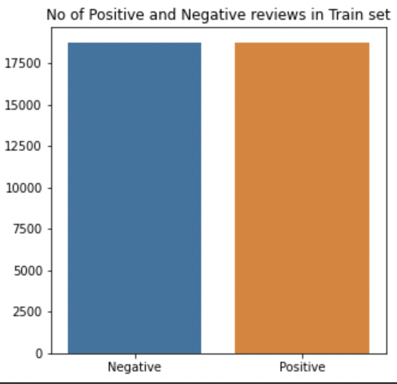
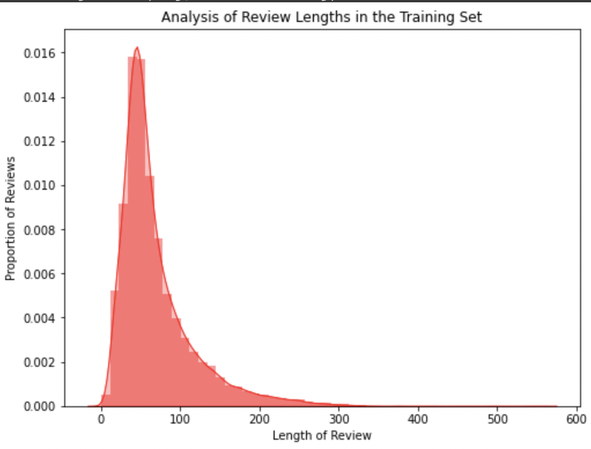
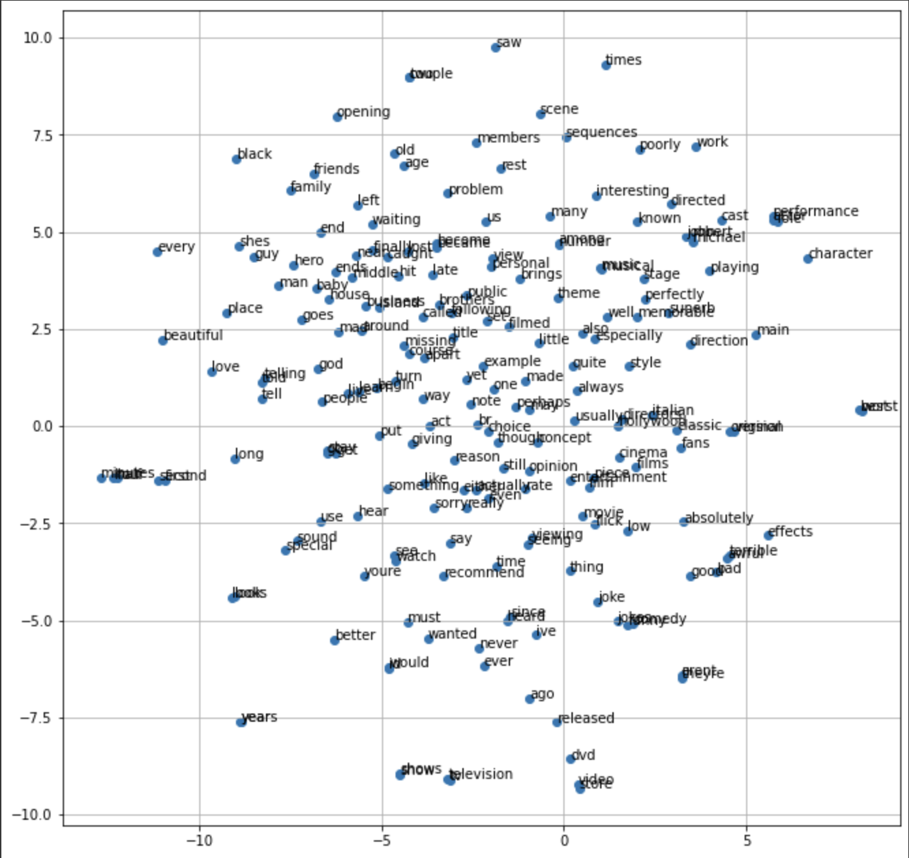
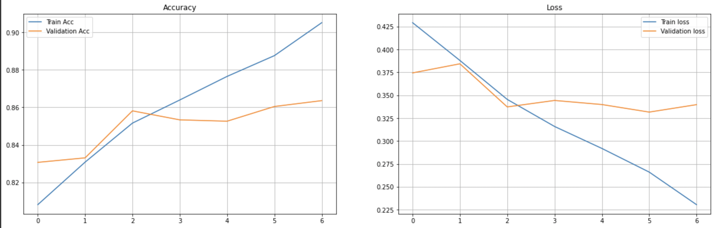

<h2> NLP Codes </h2>

### N-GRAM LANGUAGE MODELS
We implement the simple n-gram language model using Python and uses the perplexity as a measure of learning.

### SENTIMENT ANALYSIS USING LSTM

This short project builds a model which performs sentiment analysis and classifies IMDB movie reviews as positive or negative with some probability.
The model uses Long Short Term Memory Architecture (LSTM) architecture in this model with the help of Pytorch.
  

  
 

 
